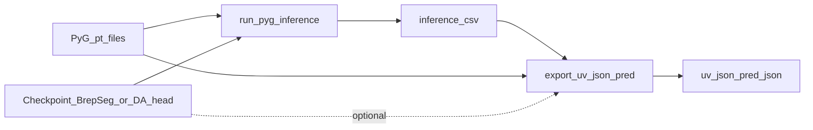

# Test inference journey (manual PyG batch + UV JSON predictions)

This note records how we ran **frozen-model face labeling** on a **hand-prepared triple-dataset eval tree**, how that differs from `domain_adapt.py test`, what scripts and commands we used, and what we measured. It reflects the tooling as of implementation in **`BrepMFR_PyG`**.

---

## 1. High-level goals

1. Take **fine-tuned** checkpoints (Stage 1 **`BrepSeg`** or Stage 2 **`DomainAdapt`**) and evaluate **many pre-built PyTorch Geometric graphs** **without** the full Lightning `Trainer.test()` harness.
2. Write **human-auditable** outputs:
   - one **CSV per graph** with predicted class names and softmax probability for **every face**,
   - optional **accuracy vs stored labels** when `label_feature` (or JSON sidecars) remain valid evaluation targets.
3. From the same `.pt`, export **predicted-label UV lattice JSON** (parallel to **`extract_uv_points.py`**) into **`uv_json_pred/`**.

---

## 2. Data pipeline context (graphs you already built)

Operational graph construction for Experiment-style data (macro + Python) is Conceptually:

1. **SolidWorks macro** produces per-model JSON.
2. **`scripts/inference/json_to_brepmfr_pyg.py`** (this repo; **`conda activate brep_mfr_pyg`**) emits **PyG `.pt`** directly—same tensors as **`BrepMFR/json_to_brepmfr_bin.py`** → **`convert_dgl_bins_to_pyg` / `bin_to_pyg`** (validated with **`scripts/diagnostics/json_pyg_parity_vs_bin.py`**; running that parity currently needs **`conda activate brep_mfr`** on the reference path because **`dgl.data.utils.load_graphs`** loads the `.bin`).
3. **Legacy two-step:** **`json_to_brepmfr_bin.py`** (typically the **`BrepMFR`** copy) emits DGL `.bin`, then **`scripts/inference/convert_dgl_bins_to_pyg.py`** writes **`.pt`**.

Operational validation for new ingestion should use **`Z:\Experiment_test`** (copies only); do not mutate **`Z:\Experiment6`** / **`Z:\Experiment6_PyG`** while checking parity.

For the **evaluation described here**, graphs were already materialized under **`graph/pyg/*.pt`**; we never re-invoked STEP/JSON conversion.

---

## 3. Evaluation dataset layout (`Y:\new_dataset\test`)

Triple dataset split used for ad-hoc testing:

| Dataset   | PyG root | Inference CSV output | UV JSON pred output |
|-----------|----------|----------------------|---------------------|
| cadsynth  | `Y:\new_dataset\test\cadsynth\graph\pyg` | `...\cadsynth\inference\` | `...\cadsynth\uv_json_pred\` |
| mfcadpp   | `Y:\new_dataset\test\mfcadpp\graph\pyg`  | `...\mfcadpp\inference\`  | `...\mfcadpp\uv_json_pred\`  |
| abc       | `Y:\new_dataset\test\abc\graph\pyg`      | `...\abc\inference\`      | `...\abc\uv_json_pred\`      |

**Observed scale** (one machine run that completed successfully):

- **cadsynth**: 10 `.pt` files  
- **mfcadpp**: 10 `.pt` files  
- **abc**: 142 `.pt` files  
- **Total graphs processed**: 162  

**Optional ground truth sidecars:** `graph/label/` or `graph/labels/` with `<stem>.json` in `_write_label_json` format can supply labels if `label_feature` on `.pt` is unusable.

---

## 4. Relationship to `domain_adapt.py test`

**Full-dataset official test** (paired source/target every batch):

```powershell
python domain_adapt.py test `
  --dataset transfer `
  --source_path Z:/Experiment6_PyG/source_dataset `
  --target_path Z:/Experiment6_PyG/target_dataset `
  --checkpoint C:/Users/D58/Desktop/BrepMFR_PyG/results/.../best.ckpt `
  --batch_size 32 `
  --num_workers 0
```

That path uses **`TransferDataset`** + **`collator_st`** and expects split lists + directory trees from the **Experiment6_PyG** layout.

**Our batch scripts** instead:

- scan **any** `graph/pyg` tree you point at,
- batch with **single-domain** **`collator`** (`multi_hop_max_dist=16`, `spatial_pos_max=32`),
- never require `s_test.txt` / `t_test.txt` pairing for one-off benchmarking.

Those are complementary: **trainer test** stays the reproducible Experiment6 metric; **`run_pyg_inference.py`** is flexible ad-hoc graph folders.

---

## 5. Model loading strategy (checkpoint compatibility)

Both Stage 1 (**`BrepSeg`**) and Stage 2 (**`DomainAdapt`**) Lightning checkpoints store **`brep_encoder.*`**, **`attention.*`**, **`classifier.*`**.

We deliberately **avoid** **`DomainAdapt.load_from_checkpoint`** for offline CSV tools because **`DomainAdapt.__init__`** re-loads **`BrepSeg` from `--pre_train`**, breaking when archival paths moved.

Recipe (shared by inference + UV export fallback):

1. **`torch.load(ckpt)`** → **`hyper_parameters.args`** reconstructed as **`argparse.Namespace`**, with **`pre_train=None`**, bogus **`class_weights_path`** cleared if missing.
2. Instantiate **`BrepSeg(args)`**.
3. **`load_state_dict`** restricted to **`brep_encoder.` / `attention.` / `classifier.`** prefixes; merge **`class_weights`** buffer when present else ignore missing (**training CE only**, not predictive path).
4. Load **eval** masks + forward identical to **`BrepSeg.validation_step`** tensor slicing (drop virtual node dim, attention fusion, softmax classifier heads).

Classifier tensor path must match **`NonLinearClassifier`**: softmax over logits at output; script renormalizes safely if logits appear.

---

## 6. Script A — bulk CSV inference

**Path:** [`scripts/inference/run_pyg_inference.py`](file:///c:/Users/D58/Desktop/BrepMFR_PyG/scripts/inference/run_pyg_inference.py)

### Invocation (example matching our run)

```powershell
cd C:\Users\D58\Desktop\BrepMFR_PyG
conda activate brep_mfr_pyg

python scripts/inference/run_pyg_inference.py `
  --checkpoint C:\Users\D58\Desktop\BrepMFR_PyG\results\stage2\transfer_iwdan_weighted__2026-05-05_134214\best.ckpt `
  --device cuda `
  --batch_size 4 `
  --dataset_root Y:\new_dataset\test
```

### Main CLI knobs

| Argument | Meaning |
|---------|---------|
| `--checkpoint` (required) | Lightning `.ckpt` |
| `--dataset_root` | Parent of **`cadsynth` / `mfcadpp` / `abc`** (default **`Y:\new_dataset\test`**) |
| `--only abc,mfcadpp,cadsynth` | Subset toggle |
| `--device` **`cuda`** / **`cpu`** | Honors **`cpu`** even if CUDA visible |
| `--batch_size` | Graphs grouped per **`collator`** flush |
| `--multi_hop_max_dist`, `--spatial_pos_max` | Default **16**, **32** (match **`TransferDataset`**). |
| `--max_files` | Debug truncation per dataset |

### Outputs

Mirrors stem: **`graph/py/foo.pt` → `inference/foo.csv`**.

### CSV columns

Always:

- **`face_index`**
- **`predicted_class`** (integer 0 … `num_classes-1`)
- **`predicted_class_name`** (CADSynth **25-way** canonical names when matching checkpoint **`num_classes=25`**)
- **`predicted_probability`**

When ground truth resolves:

- **`ground_truth_class`**, **`ground_truth_class_name`**, **`correct_top1`** (1 if argmax prediction equals GT).

**GT precedence:**

1. **`Data.label_feature`** if length **`N_faces`** & every element in **`[0, num_classes)`**.
2. Else **`graph/label/<stem>.json`** or **`graph/labels/<stem>.json`** with `_write_label_json` payload.
3. Else predictions-only CSV (typical noisy **abc** copies without coherent embedded labels).

**Console summary per cohort:** **`pt_candidates`**, **`graphs_ok`**, **`total_faces_written`**, plus **overall top-1 accuracy** over faces carrying GT (**if any**).

---

## 7. Measured headline numbers (representative logged run)

Run used GPU CUDA with **`best.ckpt`** from **`results/stage2/transfer_iwdan_weighted__2026-05-05_134214/`** (Stage **2 DomainAdapt-trained** segmentation head fused into **`BrepSeg`** reconstruction).

Approximate aggregates:

| Subset | Graphs scanned | Faces written | Top-1 (faces with GT) |
|--------|-----------------|---------------|-------------------------|
| **cadsynth** | 10 | 261 | **~98.9%** |
| **mfcadpp**  | 10 | 331 | **~95.8%** |
| **abc**      | 142 | 1619 | *(no aggregated accuracy line printed — GT seldom consistent / absent)* |

> Re-run on another machine/path may drift slightly; reconcile with your own **`run_pyg_inference`** console tail + CSVs.

Interpretation caveat: numeric labels on **different corpora** (especially **CADSynth-trained head** vs **pure ABC geometry**) may not be semantically identical even when numeric ranges overlap — treat **pure ABC** CSV as **pseudo-label exploratory** unless a verified mapping exists.

---

## 8. Script B — predicted UV JSON export (`uv_json_pred`)

**Path:** [`scripts/inference/export_uv_json_pred.py`](file:///c:/Users/D58/Desktop/BrepMFR_PyG/scripts/inference/export_uv_json_pred.py)

**Standalone** (does **not** import **`extract_uv_points.py`**) yet follows the **same** JSON nesting / metadata keys demonstrated in reference **`Y:\uv_json\00000000.json`**:

Top-level schema:

```
file, bin_path, label_path, num_faces_in_graph, num_labels_in_json, num_labeled_faces, faces[]
```

each **`faces`** record:

```
face_index, label, uv_grid, uv_meta
```

### Semantics deltas vs original extractor

| Field | Meaning here |
|-------|----------------|
| **`bin_path`** | Absolute **`graph/pyg/<stem>.pt`** (string key name unchanged for tooling compatibility). |
| **`label_path`** | Matching **`inference/<stem>.csv`** when CSV drove predictions |
| **`label`** | Argmax **predicted** class (**not GT** necessarily) |
| **Face filter** | Skip faces predicted **Stock** (**`label == 0`**) analogous to extractor skipping **`GT==0`**. |

**UV grid source:** **`Data.node_data[face]`** flattened / reshaped with duplicated **`infer_uv_grid`** logic (parity with **`extract_uv_points._infer_uv_grid`**).

### Invocation

```powershell
conda activate brep_mfr_pyg
cd C:\Users\D58\Desktop\BrepMFR_PyG

python scripts/inference/export_uv_json_pred.py --dataset_root Y:\new_dataset\test --device cuda
```

Use **`--checkpoint path\to\best.ckpt`** if some graphs lack **`inference/*.csv`** (rerun forward lazily).

**`--skip_existing`** avoids overwriting prior JSON churn.

Representative holistic export log (after inference CSV existed everywhere needed):

```
TOTAL ok=162 fail=0
```

Broken down: **10 + 10 + 142** JSON files under each respective **`uv_json_pred`**.

---

## 9. Class name table (CADSynth 25)

IDs **0 … 24** used for column naming / interpretation when **`num_classes=25`** matches training:

See enum inside [`scripts/inference/run_pyg_inference.py`](file:///c:/Users/D58/Desktop/BrepMFR_PyG/scripts/inference/run_pyg_inference.py) (`FACE_LABEL_NAME` dict). Index **0 = Stock**, **17 = Through hole**, **23 = Blind hole**, etc.

When checkpoint **`num_classes` ≠ 25**, unknown indices fall back to textual **`class_<id>`** with a console warning.

---

## 10. Pitfalls & lessons learned (chronological engineering notes)

1. **pythonocc / occwl vs JSON path:** Direct STEP via **occwl** diverges from SolidWorks-lattice JSON → prefer **evaluating** models using graphs generated by **your** macro plus **`scripts/inference/json_to_brepmfr_pyg`** (or the legacy **`json_to_brepmfr_bin`** + **`convert_dgl_bins_to_pyg`** path) for apples-to-apples geometry encodings.
2. **Lightning partial load vs `class_weights` buffer:** Buffer missing from filtered keys should not fail load; ignorable.
3. **Stage 2 init & `pre_train`:** Never rely on **`load_from_checkpoint(DomainAdapt)`** for single-graph tools.
4. **Test split still may embed `label_feature`:** Test held-out from **training updates** but often still ships **supervision vectors** for metrics — do not confuse with label leakage into forward (GT only touches loss / CSV compare).
5. **Environment:** GPU stack uses **`conda` env `brep_mfr_pyg`** (Torch + **PyG**). Legacy DGL conversion env historically **`brep_mfr`** — not needed once `.pt` exist.

---

## 11. Quick command cheat sheet

```powershell
# (A) Batch CSV inference (default dataset_root Y:\new_dataset\test)
python scripts/inference/run_pyg_inference.py --checkpoint <CKPT> --device cuda --batch_size 4

# (B) UV JSON predicted export (after CSVs)
python scripts/inference/export_uv_json_pred.py --dataset_root Y:\new_dataset\test --device cuda

# (B alt) If some CSV missing:
python scripts/inference/export_uv_json_pred.py --dataset_root Y:\new_dataset\test `
  --checkpoint <CKPT> --device cuda
```

Optional earlier single-sample exploration (different script, not bulk above): **`scripts/inference/step_infer_features.py`** (STEP/`--graph` path) kept for prototyping; bulk eval path prefers **`run_pyg_inference.py`**.

---

## 12. Files touched / added along this arc (reference)

| File | Role |
|------|------|
| [`scripts/inference/run_pyg_inference.py`](file:///c:/Users/D58/Desktop/BrepMFR_PyG/scripts/inference/run_pyg_inference.py) | Bulk `.pt` → CSV inference |
| [`scripts/inference/export_uv_json_pred.py`](file:///c:/Users/D58/Desktop/BrepMFR_PyG/scripts/inference/export_uv_json_pred.py) | `.pt` + CSV → **`uv_json_pred/*.json`** |
| [`data/dgl_bin_to_pyg.py`](file:///c:/Users/D58/Desktop/BrepMFR_PyG/data/dgl_bin_to_pyg.py) | Historical `.bin→pt` parity reference |
| [`extract_uv_points.py`](file:///c:/Users/D58/Desktop/BrepMFR_PyG/extract_uv_points.py) | Legacy DGL exporter (GT labels); schema reference only |

---

## 13. Appendix — mental dataflow diagram



---

*End of document — adjust paths & metrics if your drive letters or checkpoint filenames differ.*
